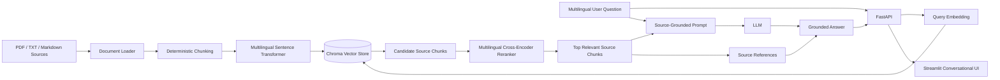

# Architecture

## System Architecture



## Retrieval and Generation Flow

The system uses a two-stage retrieval process followed by source-grounded answer generation.

1. Documents are loaded from PDF, TXT, or Markdown files.
2. Documents are divided into deterministic text chunks.
3. Each chunk is converted into a multilingual embedding.
4. Embeddings and source metadata are stored in Chroma.
5. A user question is embedded using the same multilingual embedding model.
6. Chroma retrieves a wider set of semantically relevant candidate passages.
7. A multilingual cross-encoder reranks the candidates using the question and passage together.
8. The highest-ranked passages are supplied to the LLM as context.
9. The LLM generates an answer using only the retrieved evidence.
10. The answer and supporting source passages are returned through FastAPI and displayed in Streamlit.

## Design Decisions

### Multilingual embeddings

Embeddings are produced locally using a multilingual Sentence Transformer.

This enables cross-lingual retrieval, allowing questions in languages such as English, Hindi, and German to retrieve relevant information from primarily English-language source documents.

### Two-stage retrieval

The system uses semantic vector search followed by multilingual cross-encoder reranking.

Chroma first retrieves a wider candidate set based on embedding similarity. The cross-encoder then evaluates each question-passage pair and reorders the candidates according to relevance before the best passages are supplied to the generation layer.

This approach was introduced after preliminary testing showed that semantic search could identify the correct evidence but did not always rank it highly enough.

### Persistent vector storage

Chroma is configured as a persistent local vector store so that generated embeddings survive application restarts and do not need to be rebuilt for every query.

### Source-grounded generation

The LLM receives the user's question together with only the highest-ranked retrieved passages.

The generation prompt instructs the model to:

* answer using the supplied evidence
* avoid filling unsupported information gaps
* include numbered source references
* state when the available evidence is insufficient
* respond in the user's language where possible

### Explicit API boundary

Retrieval and answer generation are exposed through FastAPI rather than being implemented only inside the user interface.

The main endpoints are:

```text
GET  /health
GET  /stats
POST /retrieve
POST /ask
```

This separates application logic from presentation and makes the retrieval and RAG services reusable by other clients.

### Separate user interface

Streamlit acts as a client of the REST API.

The interface provides:

* conversational question input
* generated answers
* supporting retrieved passages
* source inspection
* configurable retrieval depth
* session-level chat history

### Source metadata and traceability

Each indexed chunk stores metadata including:

* original source filename
* chunk identifier
* chunk index

The retrieved passages are returned alongside generated answers so users can inspect the evidence used by the system.

## Preliminary Retrieval Validation

Initial cross-lingual testing used equivalent questions in English, Hindi, and German against primarily English-language source documents.

For a test question asking for the average UK house price in May 2026, semantic retrieval initially placed the correct ONS passage containing the £271,000 figure at rank 5.

After introducing multilingual cross-encoder reranking, the correct passage was returned at rank 2 for the equivalent English, Hindi, and German queries.

This represents an initial functional validation rather than a comprehensive retrieval benchmark.
