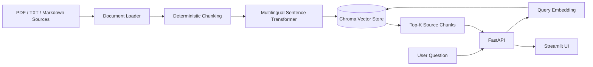
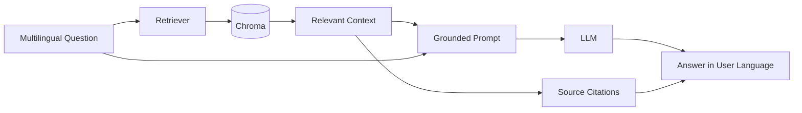

# Architecture

## Current Stage

## Planned RAG Stage

## Design Decisions

### Local multilingual embeddings

Embeddings are produced locally using a multilingual Sentence Transformer.

### Persistent vector storage

Chroma is configured as a persistent local vector store so embeddings survive application restarts.

### Explicit API boundary

Retrieval is exposed through FastAPI rather than being embedded only inside the UI.

### Separate UI

Streamlit acts as a client of the REST API.

### Source metadata

Each indexed chunk stores its original filename and chunk index so retrieved evidence can be traced back to its source.
